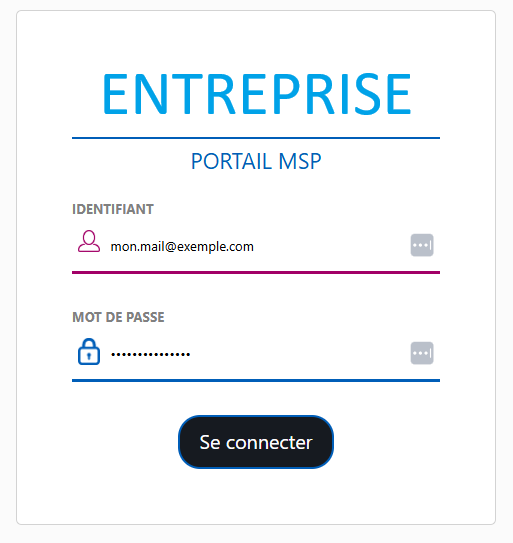
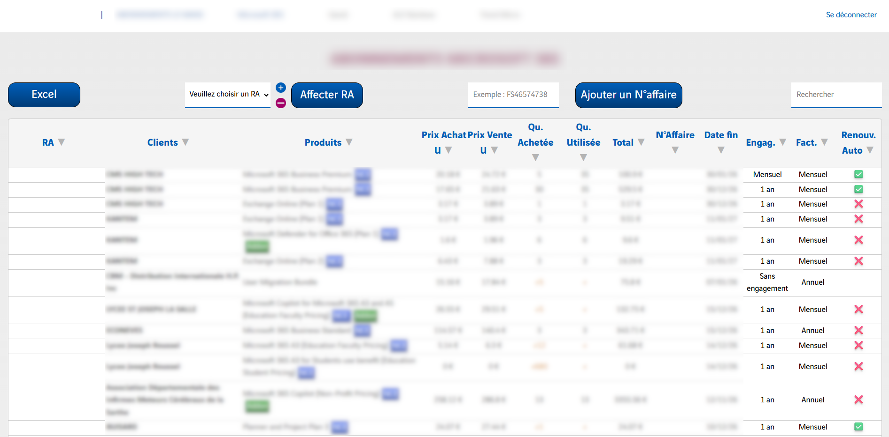

# PortailMSP

## Introduction

Le PortailMSP est un outil interne dans l'entreprise ou j'ai fait mon stage de 2e année en BUT Informatique (7 avril - 13 juin 2025). Il permet la centralisation des informations liés aux licences vendues par les fournisseurs pour les clients dans mon entreprise.

Ici, j'ai travaillé seul sur la refonte globale du site tout en ayant un code maintenable, de qualité et permettre l'ajout de nouveau fournisseur.

### Fonctionnalités mises en place :

- Données récupérables dans un excel
- Système d'authentification avec l'active directory
- Gestion (CRUD) d'affectation des responsables d'affaires aux clients
- Ajout d'un numéro d'affaire pour chaque licences
- Vérification de la qualité de code via différents outils.
- Tests complets Frontend et Backend
- Ajout de nouvelles informations de 2 nouveaux fournisseurs

Le chemin des données était le suivant :\
-> API Fournisseur\
-> Backend qui récupère les informations des fournisseurs et les reformattent pour l'affichage voulu\
-> Frontend qui permet l'affichage des données proprement

   
  <em>Page de connexion</em>

   
  <em>Exemple de tableau d'une page d'un fournisseur</em>

*Le site a été mis en production avec mon maître d'alternance et est actuellement maintenu par mes soins.*

**Langages et programmation :**
- HTML/CSS
- JSX
- JavaScript
- PHP
- SQL

**Frameworks, bibliothèques et outils de développement front/back :**
- Tailwind
- Symfony
- React
- Vite

**Bases de données et API / testing :**
- MariaDB
- PostMan
- PhpUnit
- PhpStan
- Cypress

**Outils, environnements et gestion de projet :**
- Docker
- WSL
- PhpStorm
- SonarQube
- ESLint
- Git
- Teams
- Miro

**[Retour](../index.md)** 